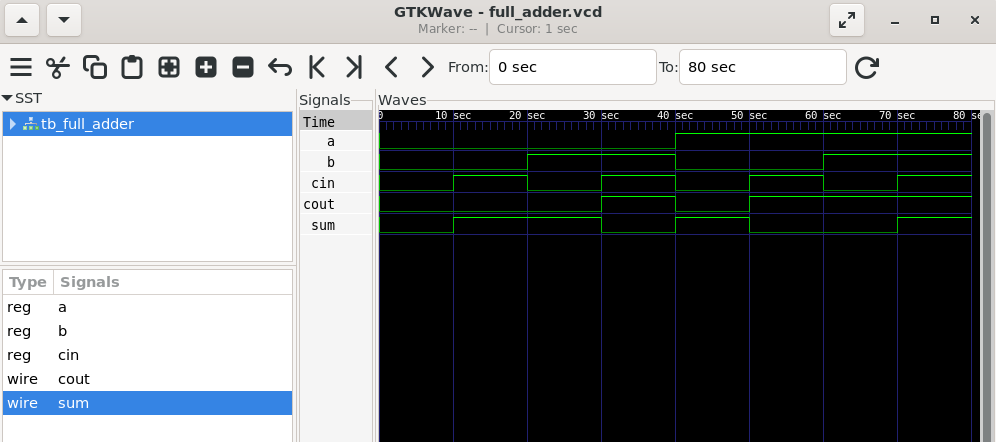

# 1-Bit Full Adder in Verilog

## Overview

This project implements a 1-bit Full Adder using Verilog HDL and verifies its functionality using a testbench.

A Full Adder adds three 1-bit inputs (`A`, `B`, and `Cin`) and produces a **Sum** and a **Carry-Out**.

## Truth Table

| A | B | Cin | Sum | Cout |
|---|---|-----|-----|------|
| 0 | 0 | 0 | 0 | 0 |
| 0 | 0 | 1 | 1 | 0 |
| 0 | 1 | 0 | 1 | 0 |
| 0 | 1 | 1 | 0 | 1 |
| 1 | 0 | 0 | 1 | 0 |
| 1 | 0 | 1 | 0 | 1 |
| 1 | 1 | 0 | 0 | 1 |
| 1 | 1 | 1 | 1 | 1 |

## Files

- `full_adder.v` – RTL design
- `tb_full_adder.v` – Testbench

## How to Run

```bash
iverilog -o sim full_adder.v tb_full_adder.v
vvp sim
gtkwave full_adder.vcd
```

## Tools Used

- Verilog HDL
- Icarus Verilog
- GTKWave
- VS Code
- Ubuntu (WSL)

## Simulation Waveform



## Author

Agam Sharma